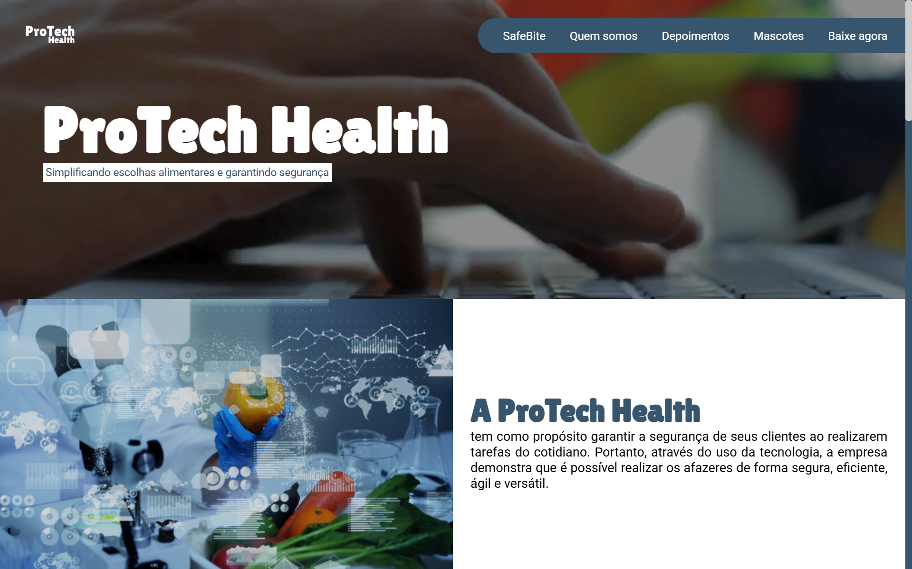

<h1 align="center">ProTech Health – SafeBite 🛡️</h1>

<h4 align="center"><a href="https://theodantas.github.io/ProTech_Health/">Confira o projeto aqui</a></h4>

---

## 📌 Sobre o Projeto

Projeto desenvolvido com o intuito de apresentar o aplicativo SafeBite, uma solução tecnológica criada para promover segurança alimentar e escolhas mais conscientes, auxiliando pessoas com alergias, intolerâncias ou restrições alimentares.

## 🛠 Tecnologias utilizadas:

O site foi construído com foco em performance, minimalismo e dinamismo. As tecnologias utilizadas foram:

    
    
    

## 📚 Alguns conceitos aplicados

Neste projeto apliquei os seguintes pontos:

✔️ Semântica HTML  
✔️ Design minimalista e limpo  
✔️ Responsividade  
✔️ Organização com CSS Variables  
✔️ Estruturação com Grid e Flexbox  
✔️ Código modular e bem organizado  
✔️ Estrutura focada em acessibilidade  

---

<table align="center">
  <tr>
    <td>
      
    </td>
    <td>
      Feito por <a href="https://github.com/theodantas">Théo Dantas.</a> 🙋‍♂️
    </td>
  </tr>
</table>
